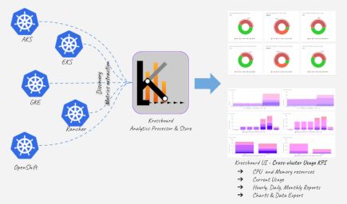
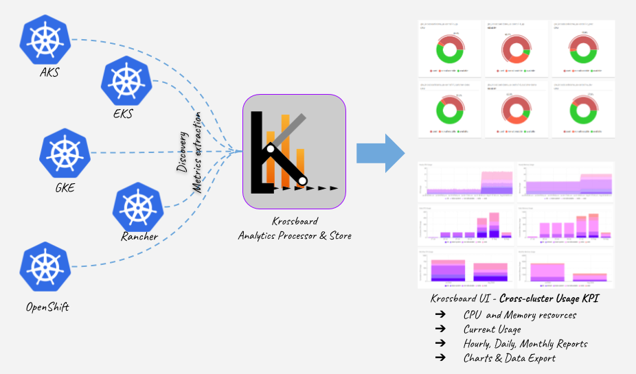

---

# Overview
`krossboard-data-processor` is the backend component of [Krossboard](https://github.com/2-alchemists/krossboard).

Key features:

 * **Multi-Kubernetes Data Collection**: Periodically collecting raw metrics related to containers, pods and nodes from several Kubernetes source clusters. By design, the data collection period is 5 minutes.
 * **Powerful Analytics Processing**: Internally process raw metrics to produce insightful Kubernetes usage accounting and analytics metrics. By design, these analytics metrics are handled on a hourly-basis, for every namespace, cluster, and also globally.
 * **Insightful Usage Accounting**: Periodically process usage accounting, for each cluster and cluster's namespace. In the current implementation, the accounting is handled by design for the following period:  daily for the 14 last days, monthly for the 12 last months.
 * **REST API**: Exposes the generated analytics data to third-party systems. For example, [Krossboard UI](https://github.com/2-alchemists/krossboard-ui) consumes this API to produce its charts and dashboards. 
 * **Easy to deploy**: Krossboard can be easily deployed through a virtual machine on-premises or on public clouds. In a close future, it's expected to be deployed through a Kubernetes operator. It can be set up to automatically discover and handle Kubernetes clusters backed by Amazon EKS, Google GKE, Microsoft AKS.  

